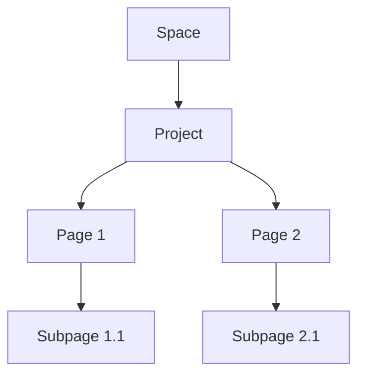

## Overview

Looly organizes your project documentation into structured spaces. You create spaces to group related docs, manage hierarchies of projects and pages, enable team collaboration, and handle versioning seamlessly. These core concepts form the foundation for effective documentation workflows.

<Callout kind="info">
  Master these concepts to build scalable documentation that grows with your projects.
</Callout>

## Key Concepts

Explore Looly's foundational building blocks through these visual overviews.

<Columns cols={2}>
  <Card title="Documentation Spaces" icon="folder" href="#documentation-spaces">
    Isolated environments for organizing docs by project, team, or topic.
  </Card>
  <Card title="Project Hierarchy" icon="layers" href="#project-hierarchy">
    Nested structure of projects, pages, and subpages for logical organization.
  </Card>
  <Card title="Collaboration" icon="users" href="#collaboration">
    Real-time editing, permissions, and review workflows for teams.
  </Card>
  <Card title="Versioning" icon="git-branch" href="#versioning">
    Track changes, revert updates, and manage releases effortlessly.
  </Card>
</Columns>

## Documentation Spaces

Documentation spaces act as top-level containers in Looly. You use them to separate concerns, such as one space per product or team.

<Steps>
  <Step title="Create a Space" icon="plus">
    Navigate to your dashboard and select `New Space`. Enter a name like `API Docs` and description.
  </Step>
  <Step title="Configure Settings" icon="settings">
    Set permissions, custom domains, and integrations.
  </Step>
  <Step title="Add Content" icon="file-text">
    Create your first project inside the space.
  </Step>
</Steps>

Spaces support custom metadata via API. Here's how to create one programmatically:

<CodeGroup tabs="JavaScript,cURL">
  ```javascript
  const response = await fetch('https://api.example.com/v1/spaces', {
    method: 'POST',
    headers: { 'Authorization': 'Bearer YOUR_API_KEY', 'Content-Type': 'application/json' },
    body: JSON.stringify({
      name: 'My Project Docs',
      description: 'Documentation for Project X'
    })
  });
  const space = await response.json();
  console.log(`Space ID: ${space.id}`);
  ```
  ```bash
  curl -X POST https://api.example.com/v1/spaces \
    -H "Authorization: Bearer YOUR_API_KEY" \
    -H "Content-Type: application/json" \
    -d '{
      "name": "My Project Docs",
      "description": "Documentation for Project X"
    }'
  ```
</CodeGroup>

## Project and Page Hierarchy

Looly uses a tree-like structure: Spaces contain Projects, which hold Pages and subpages. This hierarchy keeps content organized.



<ParamField path="spaceId" param-type="string" required="true">
  ID of the parent space.
</ParamField>

<ParamField path="projectSlug" param-type="string" required="false">
  Unique slug for the project within the space.
</ParamField>

## Collaboration Workflows

Looly streamlines team workflows with role-based access and real-time features.

<Tabs>
  <Tab title="Editor Role" icon="edit-3">
    Editors contribute content and manage pages.

    <CodeGroup tabs="Invite,Share">
      ```javascript
      // Invite team member
      await fetch('https://api.example.com/v1/invites', {
        method: 'POST',
        body: JSON.stringify({ email: 'user@example.com', role: 'editor' })
      });
      ```
      ```javascript
      // Generate share link
      const link = `https://docs.looly.com/space/${spaceId}?token=${shareToken}`;
      ```
    </CodeGroup>
  </Tab>
  <Tab title="Reviewer Role" icon="eye">
    Reviewers approve changes without edit access.
  </Tab>
  <Tab title="Admin Role" icon="shield">
    Admins control spaces and billing.
  </Tab>
</Tabs>

<Callout kind="tip">
  Use `@mentions` in comments to notify collaborators instantly.
</Callout>

## Versioning Fundamentals

Versioning in Looly tracks every change with diffs, branches, and releases. You commit changes like in Git.

<Expandable title="Advanced Versioning Options" default-open="false">
  Enable semantic versioning or custom tags via space settings.

  ```yaml
  versioning:
    type: semantic
    autoBranch: true
    tags:
      - major
      - minor
      - patch
  ```
</Expandable>

Publish a new version with this API call:

<Response tabs="200,400">
  ```json
  {
    "version": "v1.2.0",
    "changes": ["Added collaboration features", "Fixed hierarchy bugs"],
    "status": "published"
  }
  ```
  ```json
  {
    "error": "Invalid version format",
    "details": "Use semantic versioning (MAJOR.MINOR.PATCH)"
  }
  ```
</Response>

<ResponseField name="version" field-type="string" required="true">
  Semantic version tag like `v1.2.0`.
</ResponseField>

These concepts empower you to manage documentation at scale. Next, explore [Quickstart](/quickstart) for hands-on setup.